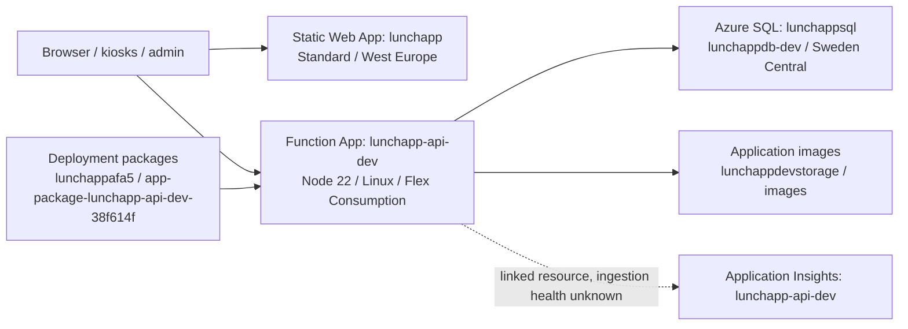
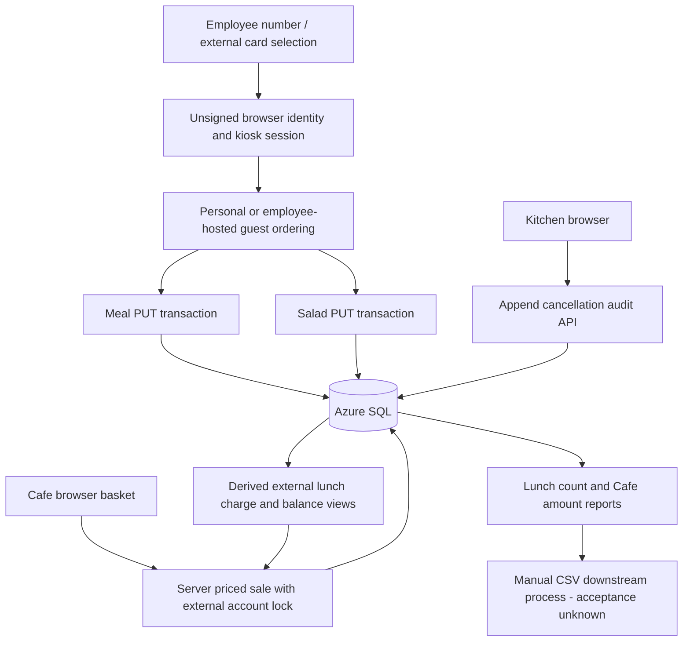

# System architecture

**Evidence baseline:** supplied source snapshot, 2026-10-08; database extraction 2026-10-08 08:01:49.5401578 UTC, DEV only. Confirmed means supported by code or completed exports, not live deployment verification. Unknown, historical, planned and recommendation labels are intentional. No application deployment, source changes, service calls or live business tests were performed.

## Component architecture

LunchApp comprises two separately deployed repositories. `lunchappDEV` provides static browser HTML/CSS/JavaScript, delivered by Azure Static Web Apps. `lunchapp-api` loads `src/functions/*.js` with the Azure Functions Node v4 programming model and exposes HTTP APIs on a separate public Function App. Backend SQL access uses the setting name `SqlConnectionString`; the browser must not connect to SQL. The image subsystem uses separate Blob credentials identified by `ImageStorageConnection` and container-setting name `ImageContainerName`.

The diagram represents evidence-backed component intent plus observed resource existence, not a live availability test. SWA and Functions communicate through a standalone API hostname rather than an embedded SWA API folder. Cross-origin browser access therefore depends on Function App CORS; current allow-list must be exported separately. Code-centric function registration differs from the Functions host schema version and extension bundle version: do not equate host.json `version: 2.0` with Node programming model v2.

SQL domains: menu configuration and multilingual meals/salads; employee and guest order ownership; cancellation history; employee post-deadline manual adjustments; external financial accounts and effective-dated lunch pricing; café products, layout, sale headers/lines and financial ledger; image metadata and product linkage. Existing Menu, Balances and KioskTransactions tables remain real extracted objects. No current API SQL usage for those three tables was located during the scoped scan; exact current operational purpose is **Unknown**, with historical POC context only.

Effective quantities and money must be separated: order quantity is the original quantity, cancellation rows record reductions, and lunch views derive active charge quantities. Café financial history is stored as ledger entries linked to sales. Product master Price uses decimal(10,2), while sale unit prices/header totals and ledger amounts use integer cents. The only extracted computed column is persisted `KioskSaleLines.LineTotalCents`, bigint multiplication of unit-price cents and quantity. RowVersion columns are timestamp/rowversion concurrency tokens, not wall-clock times.

Evidence: `lunchappDEV/docs/02-architecture/*.json`; `lunchapp-api/package.json`, `lunchapp-api/host.json`, `src/functions/images.js`; `lunchappDEV/docs/02-architecture/ARCHITECTURE-NOTES-2026-10-07.md`; `lunchappDEV/docs/07-handover/DAILY-DOCUMENTATION-2026-10-06.md`; all authoritative SQL extraction paths below.

## Runtime topology and intended audiences

- `/index.html` is the DEV/POC portal with clickable cards (inline JS `data-target`) to `/user/`, `/lunchkiosk/`, `/bulla/`, `/admin/`; it has self-contained inline styling and no API calls.
- `/user/` is employee personal-device ordering and the shared UI used by Lunch Kiosk external cards. `/user/index.html` is not a protected landing page; lunch.js redirects to login when its local owner is invalid. `/user/login.html` is employee-number directory lookup, not Entra. There is no standalone external account login in this area; external identity is supplied by kiosk card login.
- `/lunchkiosk/` is the card-reader shell for employees and external cards. `/lunchkiosk/order.html` embeds `../user/index.html` as a same-origin iframe. Moving this to another origin is not merely path renaming: shared localStorage and DOM access/postMessage validation are architectural dependencies.
- `/bulla/` is the SQL-backed Café Kiosk runtime for employee/external purchases, retaining historical Bulla folder naming. It is distinct from the historic `bulla/drunk copilot/` localStorage/demo generation.
- `/admin/` is menu/meal/salad/employee maintenance, daily/weekly kitchen summaries and lunch reports/prices. `/admin/kioskadmin/` is external accounts/cards, product/image/layout administration and café reporting. These are intended administrator/kitchen/finance audiences, **not enforced roles**.

## Session and auth contract

| Key/mechanism | Storage and consumers | Lifetime/assumptions |
|---|---|---|
| `lunch-poc-current-user-v17` | localStorage; user/login.js, lunch.js, my-orders.js; created also by lunchkiosk/card-login.js | Persistent browser/tab-shared identity; normal personal-device path has no TTL. Employee record or external record with exact cardId needed by lunch.js. No signed proof. |
| `lunch-kiosk-session-v1` | sessionStorage; lunchkiosk card login/shell | Separate tab session, nominal 60-second inactivity timer; shell also requires shared user key. Login, manual logout, timeout and successful non-guest order save clear both lunch identity/session keys. |
| `cafe-kiosk-card-session-v1` | sessionStorage; bulla login/order | Cleared on login entry, successful buy, cancel or 60-second inactivity. Funds are a login snapshot; authoritative API must enforce current funds. |
| `lunch-poc-language-v5` | localStorage; user, both kiosks, most kiosk admin pages | Shared preference but defaults differ (sv kiosk/login; en ordering/admin if absent). Language preference is not cleared with identity. |
| `lunch-poc-admin-language-v1` | localStorage; admin-i18n.js | Separate admin preference, English source keys and Swedish/Finnish dictionaries, mutation observer and `admin-language-changed` events. |
| `lunchapp-admin-language-v1` | localStorage; kiosk-reports-ui.js | Separate café report language default sv. |
| `lunch-report-language` | localStorage; lunch-reports-ui.js | Separate lunch report preference default sv. |
| Legacy `bulla-poc-*`, `lunch-poc-*` order/menu/employee keys | localStorage and old sessionStorage | POC/demo data in historic café and still-referenced Order Explorer, not current SQL order truth. Do not migrate these casually into real financial data. |

Card-reader normalization strips non-digits and keeps final five digits in current lunch/café login scripts. Card validity/account relation checks belong to the backend. Kitchen displays employee number or last-five card digits; billing still aggregates at ExternalAccountID. Historical external orders with null CardID remain account history and must not be assigned to an arbitrary person/card (07 SQL/architecture notes).

Lunch shell resets its timer on parent activity and events wired into the same-origin framed document. Successful non-guest save emits `{type:'LUNCH_KIOSK_ORDER_SAVED'}` only when framed; shell checks exact origin and iframe source before logout. Guest save does not send the success logout event. Normal standalone `/user/` does not automatically log out after save. The shell catches DOM-access failures and logs a warning rather than proving cross-origin compatibility.

## Runtime flows and trust boundaries

Meal and salad saves are parallel independent transactions, not one atomic order. Café external sale+lines+Purchase ledger are one SQL transaction; SQL/Blob image operations are not distributed transactions. Views derive lunch charges rather than posting physical LunchPurchase entries. Report “served” is remaining ordered quantity, not a collection event. See `lunchapp-api/src/functions/orders.js`, `lunchapp-api/src/functions/salad-orders.js`, `lunchapp-api/src/functions/kiosk-sales.js`, `lunchapp-api/src/functions/kitchen-weekly-summary.js`, `lunchapp-api/src/functions/images.js`, and `lunchappDEV/docs/05-sql/07-module-definitions.csv`.

## Integration and configuration boundaries

- Browser→Functions is cross-origin for current active sources; Function CORS and preview origins need actual evidence. The orphaned `admin/statistics.js` uses same-origin /api, a distinct unresolved binding assumption.
- Functions→SQL uses mssql and SqlConnectionString; Functions→Blob uses @azure/storage-blob and ImageStorageConnection/ImageContainerName. No browser-direct SQL or SAS upload implementation is current.
- SWA GitHub workflow and separately documented Functions manual publish have independent revisions. No environment-variable injection in static frontend, API CI workflow, Timer-based scheduled finance delivery or external payroll connector is supplied.
- Declared FKs enforce individual object references, not caller identity or complete cross-entity owner consistency. Four employee links are logical only; domain diagrams are in 05.
- Image backing storage disallows anonymous Blob access in completed account exports. Anonymous content route/public cache is an application serving boundary, not proof of public Blob ACL or anonymous deployed platform access.

Primary source/config: `lunchappDEV/.github/workflows/azure-static-web-apps-black-bay-0c822f703.yml`, `lunchapp-api/package.json`, `lunchapp-api/host.json`, `lunchapp-api/src/functions/images.js`, `lunchappDEV/admin/statistics.js`, `lunchappDEV/docs/docs/ENTRA-ACCESS-DESIGN.md`. Planned Entra controls, deployment revision, actual service policy and recovery remain Unknown/planned; see 11/14.

