# Database relationships

**Evidence baseline:** supplied source snapshot, 2026-10-08; database extraction 2026-10-08 08:01:49.5401578 UTC, DEV only. Confirmed means supported by code or completed exports, not live deployment verification. Unknown, historical, planned and recommendation labels are intentional. No application deployment, source changes, service calls or live business tests were performed.

## Ownership and integrity background

### Menu and lunch entities

MenuCycles defines effective starting dates and a 1–8-week rotation, with Draft/Published/Archived status. MenuWeeks belongs to a cycle; week number is unique within a cycle. MenuDays is unique by week and weekday 1–5. DayMeals uniquely assigns a meal per menu day. Meals carries multilingual names, an Active archive flag and Category; the category default is Main, but **no extracted Category check constraint enforces a closed enum**. Archived referenced meals remain resolvable by FKs. Date-specific Menu is retained as a historical object, not the authoritative current rotation model.

Orders references a meal and optionally an employee, external account and kiosk card. SaladOrders is independent, not a SaladID extension on Orders. GuestOrders and GuestSaladOrders separately identify a host, date, item, quantity and work-task column. Cancellation rows choose exactly one personal/guest source and retain original order history. The historical enum literal `Employee` in cancellation tables addresses the Orders/SaladOrders branch, including external-account orders; it must not be interpreted as proof every referenced owner is an employee. ManualLunchAdjustments records separate employee/date quantity additions; SQL allows 1–50 and defaults to 1.

### External accounts and café entities

ExternalAccounts supports Prepaid/Postpaid/Invoice, validity range and credit-limit checks. KioskCards references an external account when external; SQL still allows employee-owned cards but lacks an employee FK. KioskSales contains owner, card, total, status, void metadata and optional RequestID. Employee sales require CardID NULL and external sales require CardID NOT NULL according to CK_KioskSales_OwnerReference. RequestID uniqueness is filtered to non-null values. Sale lines snapshot a product name and unit price; later master-product edits do not rewrite those snapshots. ExternalAccountLedger supports Prepayment, Purchase, Payment, Invoice, Credit, Refund, Adjustment and Reversal; purchases require SaleID, reversals require a source ledger reference and self-reversal is prohibited. Unique filters prevent repeated Purchase per SaleID and multiple reversals of one entry. These checks do not by themselves enforce monetary sign by EntryType or cross-entity account consistency.

ImageAssets stores BlobName plus metadata, not a fixed public blob URL or Base64 image. KioskProducts.ImageAssetID is a nullable FK; many products can reuse one image. Legacy ImageUrl remains a column. Images are served through Functions; deletion in code blocks referenced assets and removes unused Blob/SQL metadata. No extracted IsDeleted/Active column exists on ImageAssets, so do not invent soft-delete support. Blob/SQL operations are not one distributed transaction; code attempts cleanup if SQL insertion fails.

### Integrity boundaries

Declared FKs, PKs, UQ/indexes, checks, defaults and the complete view definitions are enumerated below. API-only invariants include same-account ownership for CardID, exactly one owner on lunch order rows, cancellation upper bounds relative to the original row, authorization and business deadlines; database checks alone do not establish those. Domain descriptions above are backed by current API SQL or view definitions and dated design evidence; names of optional metadata columns without inspected usage do not establish a downstream business process. Any unsupported individual-column meaning remains **Unknown**.

ER diagrams below use a **solid line for an extracted declared FK** and a **dotted line for a logical/current-query relationship with no declared FK**. Parent cardinality uses zero-or-one when the child FK is nullable. These are relationship summaries, not exhaustive column definitions; the full reference follows.

## All 34 declared foreign keys

| Child table | Name | Mapping | Delete | Update | Disabled/untrusted/NFR |
|---|---|---|---|---|---|
| Balances | FK__Balances__Employ__09A971A2 | EmployeeNo -> dbo.Employees.EmployeeNo | NO_ACTION | NO_ACTION | 0/0/0 |
| DayMeals | FK_DayMeals_Meals | MealID -> dbo.Meals.MealID | NO_ACTION | NO_ACTION | 0/0/0 |
| DayMeals | FK_DayMeals_MenuDays | MenuDayID -> dbo.MenuDays.MenuDayID | CASCADE | NO_ACTION | 0/0/0 |
| ExternalAccountLedger | FK_ExternalAccountLedger_Accounts | ExternalAccountID -> dbo.ExternalAccounts.ExternalAccountID | NO_ACTION | NO_ACTION | 0/0/0 |
| ExternalAccountLedger | FK_ExternalAccountLedger_Reversal | ReversesLedgerEntryID -> dbo.ExternalAccountLedger.LedgerEntryID | NO_ACTION | NO_ACTION | 0/0/0 |
| ExternalAccountLedger | FK_ExternalAccountLedger_Sales | SaleID -> dbo.KioskSales.SaleID | NO_ACTION | NO_ACTION | 0/0/0 |
| GuestOrders | FK_GuestOrders_Employee | HostEmployeeNo -> dbo.Employees.EmployeeNo | NO_ACTION | NO_ACTION | 0/0/0 |
| GuestOrders | FK_GuestOrders_Meal | OrderedMealID -> dbo.Meals.MealID | NO_ACTION | NO_ACTION | 0/0/0 |
| GuestSaladOrders | FK_GuestSaladOrders_Salads | SaladID -> dbo.Salads.SaladID | NO_ACTION | NO_ACTION | 0/0/0 |
| KioskCards | FK_KioskCards_ExternalAccounts | ExternalAccountID -> dbo.ExternalAccounts.ExternalAccountID | NO_ACTION | NO_ACTION | 0/0/0 |
| KioskLayoutItems | FK_KioskLayoutItems_Layout | LayoutID -> dbo.KioskLayouts.LayoutID | NO_ACTION | NO_ACTION | 0/0/0 |
| KioskLayoutItems | FK_KioskLayoutItems_Product | ProductID -> dbo.KioskProducts.ProductID | NO_ACTION | NO_ACTION | 0/0/0 |
| KioskProducts | FK_KioskProducts_ImageAssets | ImageAssetID -> dbo.ImageAssets.ImageAssetID | NO_ACTION | NO_ACTION | 0/0/0 |
| KioskSaleLines | FK_KioskSaleLines_Products | ProductID -> dbo.KioskProducts.ProductID | NO_ACTION | NO_ACTION | 0/0/0 |
| KioskSaleLines | FK_KioskSaleLines_Sales | SaleID -> dbo.KioskSales.SaleID | NO_ACTION | NO_ACTION | 0/0/0 |
| KioskSales | FK_KioskSales_Cards | CardID -> dbo.KioskCards.CardID | NO_ACTION | NO_ACTION | 0/0/0 |
| KioskSales | FK_KioskSales_ExternalAccounts | ExternalAccountID -> dbo.ExternalAccounts.ExternalAccountID | NO_ACTION | NO_ACTION | 0/0/0 |
| KioskTransactions | FK__KioskTran__Emplo__05D8E0BE | EmployeeNo -> dbo.Employees.EmployeeNo | NO_ACTION | NO_ACTION | 0/0/0 |
| KioskTransactions | FK__KioskTran__Produ__06CD04F7 | ProductID -> dbo.KioskProducts.ProductID | NO_ACTION | NO_ACTION | 0/0/0 |
| ManualLunchAdjustments | FK_ManualLunchAdjustments_Employees | EmployeeNo -> dbo.Employees.EmployeeNo | NO_ACTION | NO_ACTION | 0/0/0 |
| Menu | FK_Menu_Meals | MealID -> dbo.Meals.MealID | NO_ACTION | NO_ACTION | 0/0/0 |
| MenuDays | FK_MenuDays_MenuWeeks | MenuWeekID -> dbo.MenuWeeks.MenuWeekID | CASCADE | NO_ACTION | 0/0/0 |
| MenuWeeks | FK_MenuWeeks_MenuCycles | MenuCycleID -> dbo.MenuCycles.MenuCycleID | NO_ACTION | NO_ACTION | 0/0/0 |
| OrderCancellations | FK_OrderCancellations_GuestOrders | GuestOrderID -> dbo.GuestOrders.GuestOrderID | NO_ACTION | NO_ACTION | 0/0/0 |
| OrderCancellations | FK_OrderCancellations_Orders | OrderID -> dbo.Orders.OrderID | NO_ACTION | NO_ACTION | 0/0/0 |
| Orders | FK_Orders_ExternalAccounts | ExternalAccountID -> dbo.ExternalAccounts.ExternalAccountID | NO_ACTION | NO_ACTION | 0/0/0 |
| Orders | FK_Orders_KioskCards | CardID -> dbo.KioskCards.CardID | NO_ACTION | NO_ACTION | 0/0/0 |
| Orders | FK_Orders_New_Employee | EmployeeNo -> dbo.Employees.EmployeeNo | NO_ACTION | NO_ACTION | 0/0/0 |
| Orders | FK_Orders_New_Meal | OrderedMealID -> dbo.Meals.MealID | NO_ACTION | NO_ACTION | 0/0/0 |
| SaladOrderCancellations | FK_SaladOrderCancellations_Employee | SaladOrderID -> dbo.SaladOrders.SaladOrderID | NO_ACTION | NO_ACTION | 0/0/0 |
| SaladOrderCancellations | FK_SaladOrderCancellations_Guest | GuestSaladOrderID -> dbo.GuestSaladOrders.GuestSaladOrderID | NO_ACTION | NO_ACTION | 0/0/0 |
| SaladOrders | FK_SaladOrders_ExternalAccounts | ExternalAccountID -> dbo.ExternalAccounts.ExternalAccountID | NO_ACTION | NO_ACTION | 0/0/0 |
| SaladOrders | FK_SaladOrders_KioskCards | CardID -> dbo.KioskCards.CardID | NO_ACTION | NO_ACTION | 0/0/0 |
| SaladOrders | FK_SaladOrders_Salads | SaladID -> dbo.Salads.SaladID | NO_ACTION | NO_ACTION | 0/0/0 |

### Manageable relationship diagrams — domain reference
#### Menus and personal/guest meals
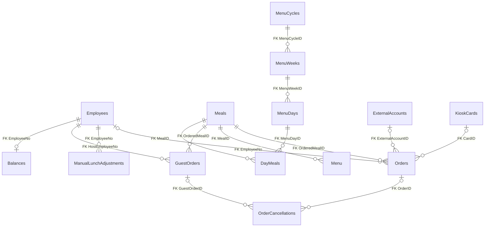

#### Salads and cancellation sources
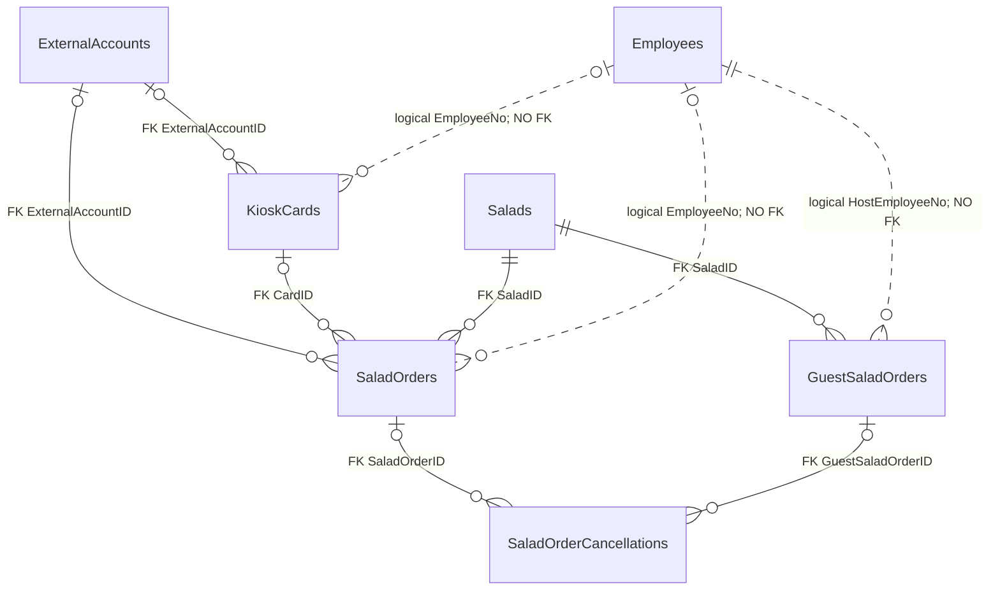

#### Café products, layouts, sales and external money
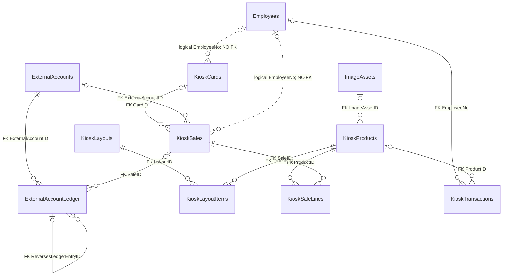

ExternalLunchPrices participates through an effective-date query, not an FK. View dependencies are a separate derived relationship graph:
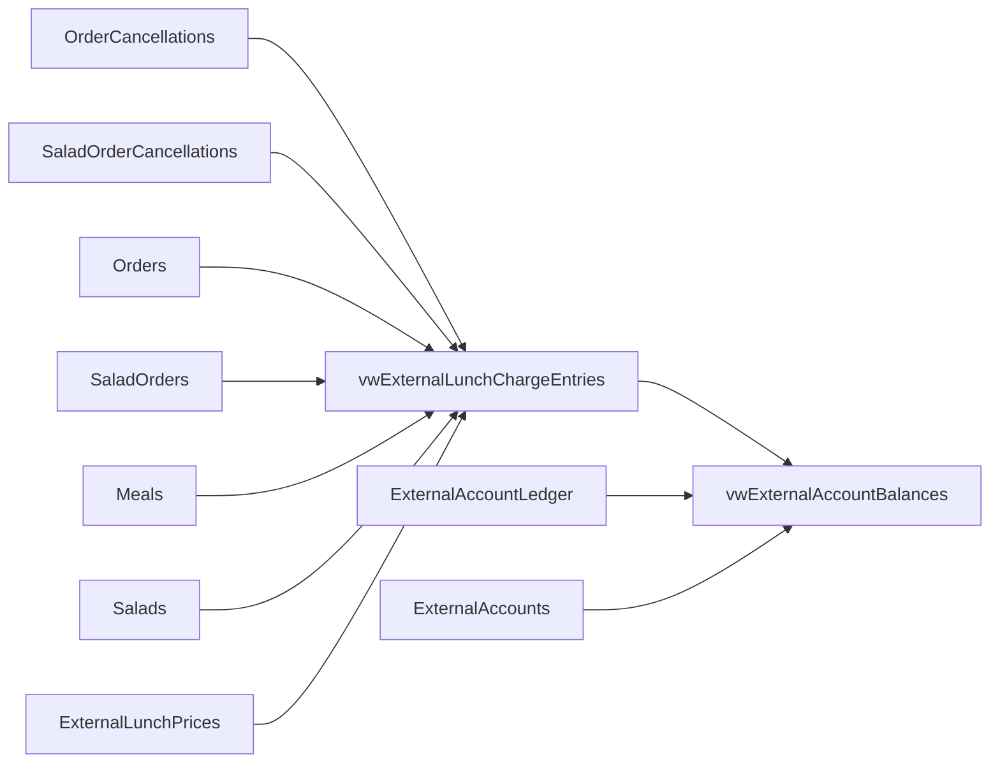

## Focused domain diagrams

These small excerpts supplement, not replace, the complete FK/index mappings and the three comprehensive ER diagrams above. Some entities/edges repeat intentionally across views. Solid = declared FK; dotted = logical relation without declared FK. Derived reporting dependencies are represented in the separate view-flow diagram, not invented as FKs. ExternalLunchPrices has no declared FK to Orders/SaladOrders; effective pricing is CROSS APPLY query logic.

### Menu/lunch

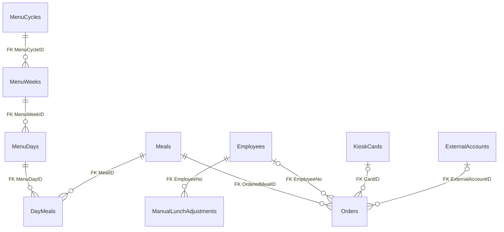

### Salad

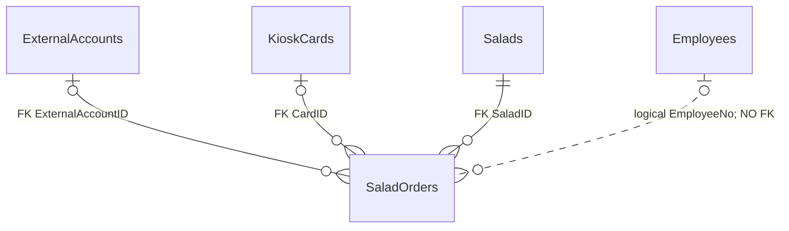

### Guest

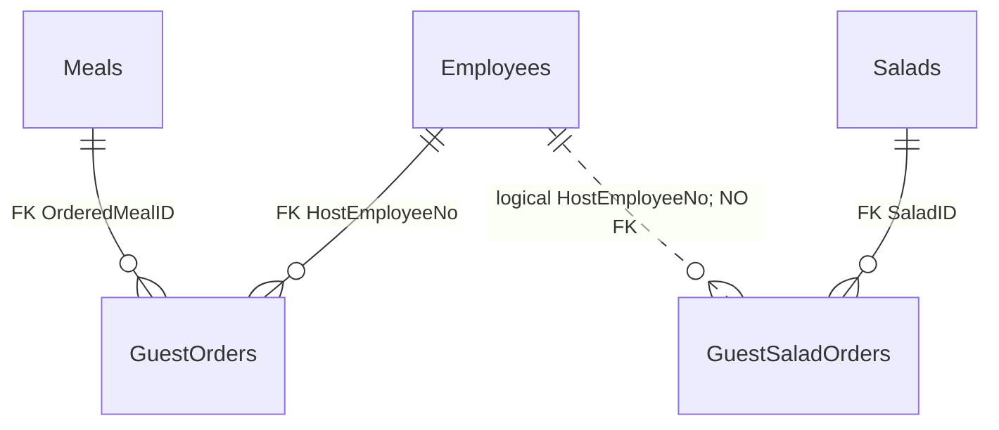

### External accounts/cards

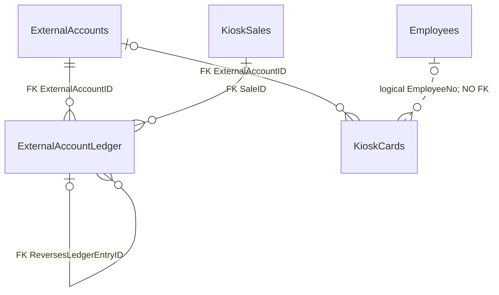

### Café kiosk

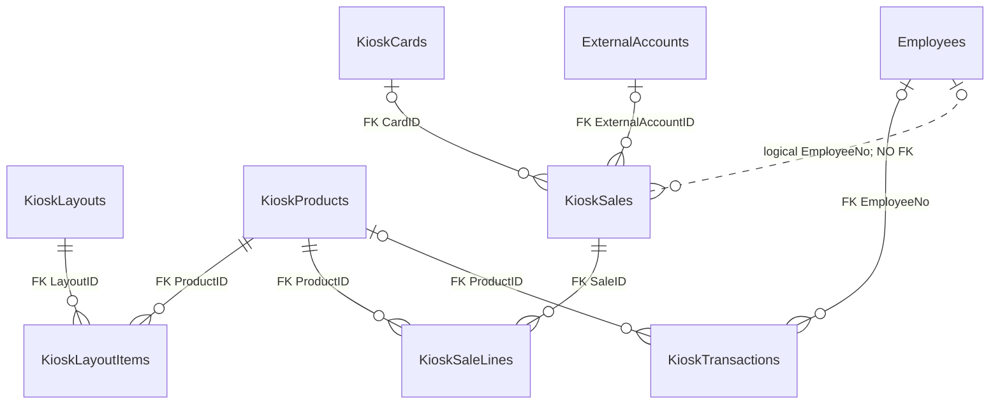

### Image library

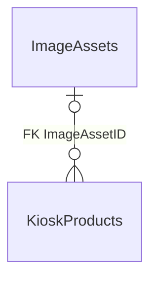

### Reporting/cancellation source integrity

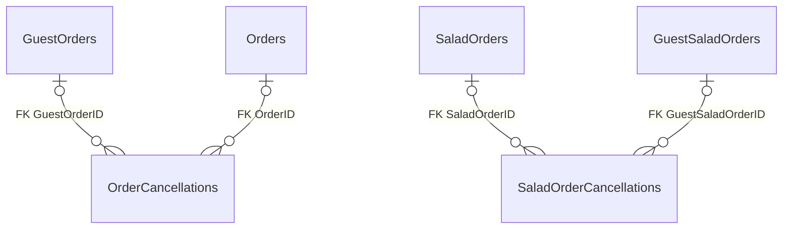

## Logical relationships and derived dependencies

The four dotted employee links are not FKs: SaladOrders.EmployeeNo, GuestSaladOrders.HostEmployeeNo, KioskCards.EmployeeNo and KioskSales.EmployeeNo. Nullable/card/account FKs do not establish same-account consistency or exactly-one-owner lunch invariant. Effective lunch pricing is a query relationship (ValidFrom <= MenuDate), not a price FK; views aggregate by account without CardID output. SourceType+SourceID is a derived composite identity, not one source table.

All extracted FK delete/update actions and trust/disabled flags are above. FK metadata source: `lunchappDEV/docs/05-sql/04-foreign-keys-1.csv` and `lunchappDEV/docs/05-sql/04-foreign-keys-2.csv`; exact nullable columns/owner checks/index filters: `lunchappDEV/docs/05-sql/02-tables-columns-2.csv`, `lunchappDEV/docs/05-sql/03-constraints.csv`, `lunchappDEV/docs/05-sql/05-indexes-1.csv`, `lunchappDEV/docs/05-sql/05-indexes-2.csv`. Full 104 view dependency rows are in 03, from `lunchappDEV/docs/05-sql/08-dependencies-fixed.csv`.

Cancellation source integrity does not ensure cancellation-aware replacement logic: meal reconciliation retains linked IDs; salad replacement attempts referenced deletion. See `lunchapp-api/src/functions/orders.js`, `lunchapp-api/src/functions/guest-orders.js`, `lunchapp-api/src/functions/salad-orders.js`, `lunchapp-api/src/functions/guest-salad-orders.js`. Diagram domains intentionally repeat some edges; the complete inventory has each of 34 FKs once.

